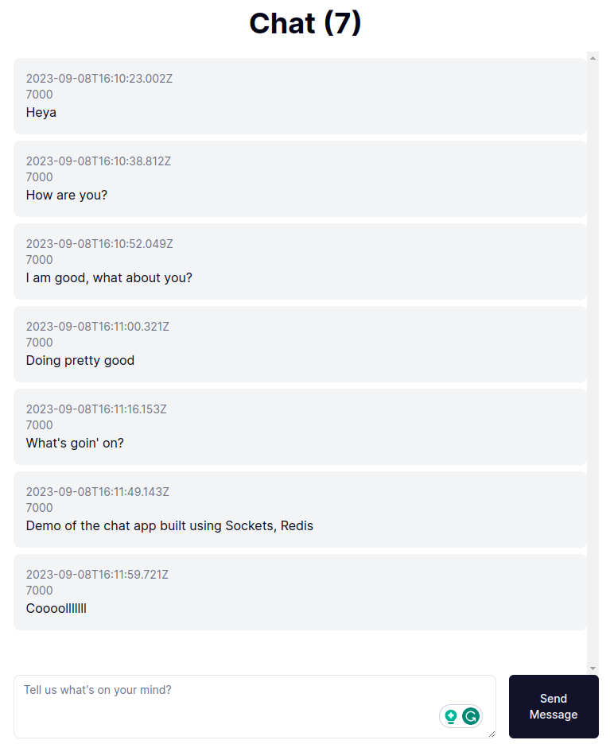
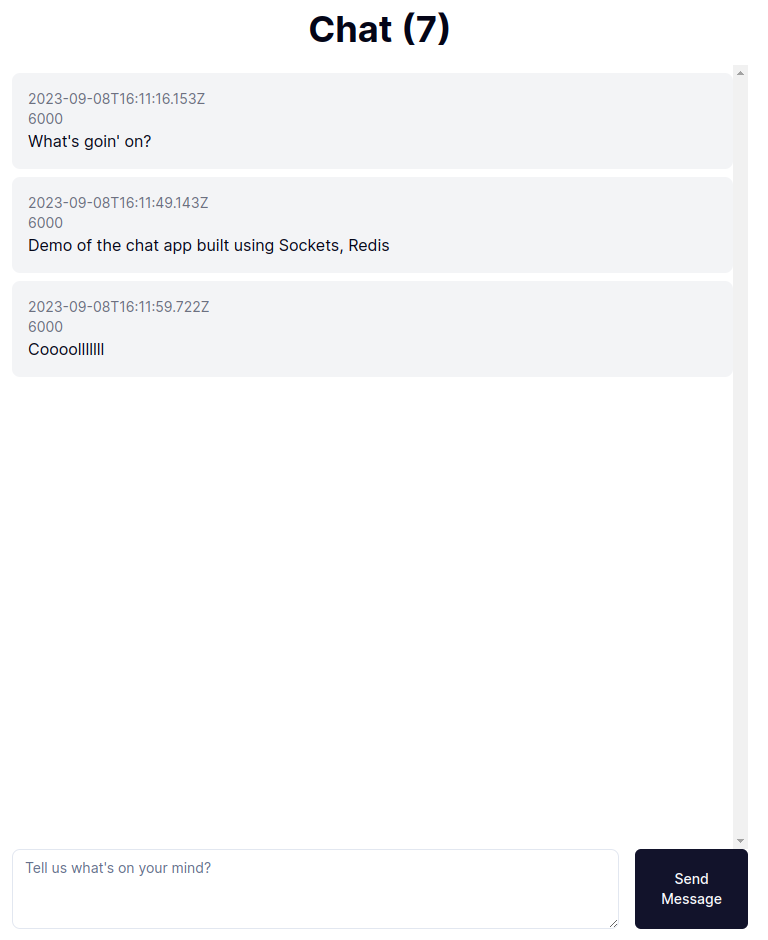

# Simple Chat app

### This is a simple chat application built to explore the world of live chat and learn sockets

## Technologies Used

This app is built with NodeJS (Fastify), Redis, TypeScript, Docker, and used Caddy for reverse proxy. In the frontend it is NextJS 13

## Screenshots

In the image

- Chat (7) means seven connections (I was testing)
- Inside the messages
  - First line is timestamp
  - Second is the port for the backend app instance
  - Third is the actual message
